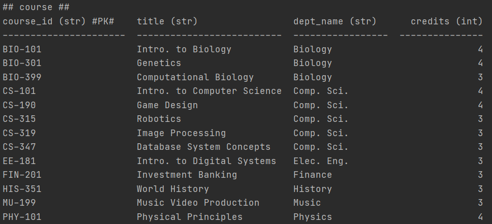
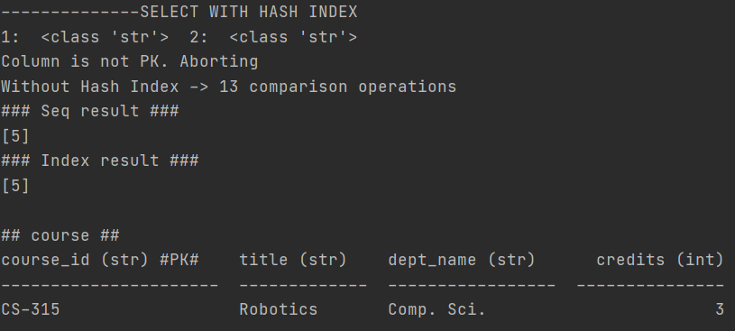
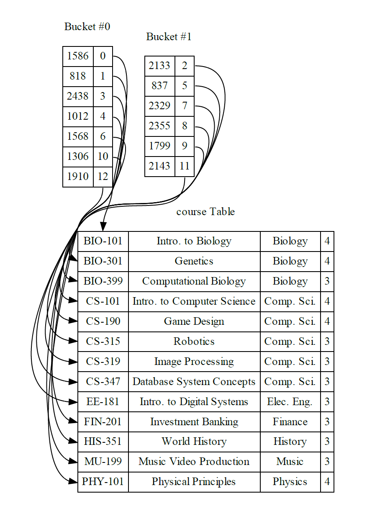

# TASK 1.3
**This readme is a small documentation for our task.**

As a team ([Prekas](https://github.com/PrekWood), [Brinias](https://github.com/IliasBrinias)) we create:
* Hash Function
* Hash Insert
* Hash Search
* Hash Join
* Hash Visualization
* Hash Delete Records (Optional)
* Hash Drop Index (Optional)


## Basic idea 

### Hash Idexing 

The Hash Index is a **list that every cell is a Bucket object**.

```python
hash_index = HashIndex()
hash_index.bucket_list = [Bucket(),Bucket(),...]
```

The bucket object contains the attribute **data** which is a list that connects
the hash key to the position of the row on the table:

`data = [[key0 ,pointer0_to_DB],[key1 ,pointer1_to_DB]]`

### Hash Function

The hash function that we used is the `VALUE mod (2**i)`,allocate the records based on
value of `i`-less significant bits (i-LSB)

## How does it work?

You can **create** the HashIndex with this command:
```python
>> db_object.create_index(table_name, index_name, column_name, index_type = 'HashIndex')
```

#### Multiple indexes

Each table can have multiple Hash Indexes based on different columns.However, hash index search can only be applied if the condition is **"=="**.

#### Select / Join

On the **select** and **inner join** command, if there's a hash index on the column you're selecting/joining and the condition is "==",
the code will automatically search on the index instead of the file. 

#### Update

Every time you **Update** elements of the table, the hash index updates automatically.

If you decide to drop the table, all the table's indexes will delete automatically.

#### Visualization

You can see the buckets with the visualization tool graphviz with the command:
```python
>> db_object.show_hashindex(index_name)
```

## Needed changes on the core of the project

The meta_indexes table definition was changed.
```python 
meta_indexes = ['table_name', 'column', 'index_name', 'index_type']
```


You can **create** the HashIndex when you create a table:
```python
>> db_object.create_table(name, column_names, column_types, primary_key, load, create_hashindex=True)
```


We created the method drop_index() in the Database class.

```python
>> db_object.drop_index(index_name)
```
# Screenshots

## Table

## Create Hash Index

## Select

## Hash Join

## Visualization

## Drop
